# Specification Index — Industrial RAG Demonstrator

> **Spec-Driven Development Contract**: Every implementation decision MUST trace back to a specification below. If a scenario is not covered, the spec must be updated BEFORE code is written.

---

## Specifications

| # | File | Scope | Status |
|---|------|-------|--------|
| 00 | [00_spec_index.md](file:///home/yash/yash/Projects/new-project/specs/00_spec_index.md) | This file — master index and cross-references | ✅ Complete |
| 01 | [01_project_overview.md](file:///home/yash/yash/Projects/new-project/specs/01_project_overview.md) | Purpose, scope, success criteria, constraints | ✅ Complete |
| 02 | [02_architecture.md](file:///home/yash/yash/Projects/new-project/specs/02_architecture.md) | System diagram, component responsibilities, data flow, directory layout, tech stack | ✅ Complete |
| 03 | [03_frontend_ui.md](file:///home/yash/yash/Projects/new-project/specs/03_frontend_ui.md) | Design language, CSS system, component tree, state composables, SSE lifecycle, responsive/accessibility | ✅ Complete |
| 04 | [04_backend_api.md](file:///home/yash/yash/Projects/new-project/specs/04_backend_api.md) | All endpoints, Pydantic schemas, SSE event format, rate limiting, CORS, error responses | ✅ Complete |
| 05 | [05_retrieval_pipeline.md](file:///home/yash/yash/Projects/new-project/specs/05_retrieval_pipeline.md) | QueryRouter, RetrievalManager, RRF, BM25, metadata filtering, logging | ✅ Complete |
| 06 | [06_llm_integration.md](file:///home/yash/yash/Projects/new-project/specs/06_llm_integration.md) | Cerebras client, prompt templates, generation params, error handling | ✅ Complete |
| 07 | [07_embedding_service.md](file:///home/yash/yash/Projects/new-project/specs/07_embedding_service.md) | Model loading, local/remote modes, implementation, perf characteristics | ✅ Complete |
| 08 | [08_data_model_and_chroma.md](file:///home/yash/yash/Projects/new-project/specs/08_data_model_and_chroma.md) | Article schema, chunking, Chroma collections, seeding, BM25 init, metrics | ✅ Complete |
| 09 | [09_feature_proofs.md](file:///home/yash/yash/Projects/new-project/specs/09_feature_proofs.md) | Per-feature baseline vs enhanced tables, comparison protocol, demo queries | ✅ Complete |
| 10 | [10_deployment.md](file:///home/yash/yash/Projects/new-project/specs/10_deployment.md) | Dockerfile, requirements.txt, startup sequence, HF Spaces config, local dev | ✅ Complete |
| 11 | [11_environment_config.md](file:///home/yash/yash/Projects/new-project/specs/11_environment_config.md) | All env vars, secrets management, configuration hierarchy, .env template | ✅ Complete |
| 12 | [12_data_generation.md](file:///home/yash/yash/Projects/new-project/specs/12_data_generation.md) | articles.json generation script, domain vocabulary, article templates | ✅ Complete |
| 13 | [13_testing_strategy.md](file:///home/yash/yash/Projects/new-project/specs/13_testing_strategy.md) | Unit/integration/E2E test plan, fixtures, coverage targets, CI | ✅ Complete |
| 14 | [14_error_handling.md](file:///home/yash/yash/Projects/new-project/specs/14_error_handling.md) | Error taxonomy, recovery strategies, user-facing messages, circuit breakers | ✅ Complete |

---

## Cross-Reference Map

Which specs a developer needs per task:

| Development Task | Primary Specs | Supporting Specs |
|-----------------|---------------|-----------------|
| Set up project skeleton | 02, 10, 11 | 01 |
| Generate mock data | 12, 08 | 01 |
| Build embedding service | 07 | 08, 11, 14 |
| Build Chroma store | 08 | 07, 02, 14 |
| Build BM25 index | 05 (BM25 section), 08 | — |
| Build QueryRouter | 05 (QueryRouter section) | 09 |
| Build RetrievalManager | 05 | 07, 08, 14 |
| Build LLM client | 06 | 11, 14 |
| Build API routes | 04 | 05, 06, 14 |
| Build Vue frontend | 03 | 04, 09 |
| Wire SSE streaming | 03 (SSE section), 04 (SSE events) | 06 |
| Implement feature toggles | 03 (composables), 04 (FeatureFlags) | 09 |
| Add comparison mode | 09 (baseline protocol), 04 | 03, 08 |
| Write tests | 13 | All |
| Docker & deploy | 10 | 11 |

---

## Implementation Order (Dependency-Driven)

```mermaid
graph LR
    A[1. Project Skeleton<br/>02, 10, 11] --> B[2. Data Generation<br/>12, 08]
    B --> C[3. Embedding Service<br/>07]
    C --> D[4. Chroma Store<br/>08]
    D --> E[5. BM25 Index<br/>05]
    E --> F[6. QueryRouter<br/>05]
    F --> G[7. RetrievalManager<br/>05]
    G --> H[8. LLM Client<br/>06]
    H --> I[9. API Routes + SSE<br/>04]
    I --> J[10. Vue Frontend<br/>03]
    J --> K[11. Integration & Polish<br/>09, 14]
    K --> L[12. Testing<br/>13]
    L --> M[13. Docker & Deploy<br/>10]
```

Each numbered step should be a PR or development phase. Tests for each component are written in the same phase (step 12 covers integration/E2E only).
