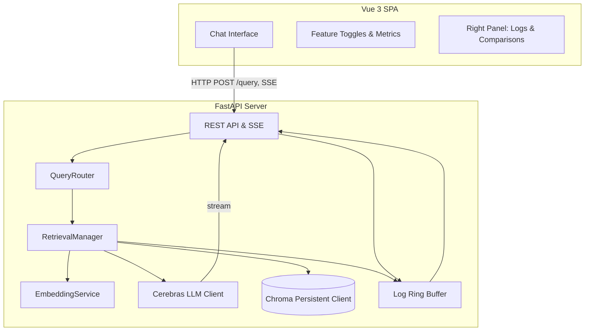
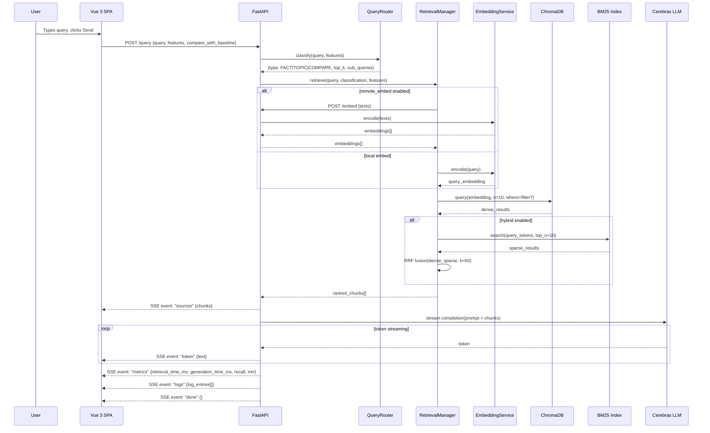

# Architecture Specification

## High‑Level Design
The system follows a client‑server architecture within a single Docker container.



## Component Responsibilities

### Frontend (Vue 3 SPA)
| Component | Responsibility |
|-----------|---------------|
| **Chat Interface** | Renders conversation messages, streams tokens from SSE, displays sources inline. |
| **Feature Toggles & Metrics** | 7 toggle switches plus a retrieval mode dropdown. Sends active feature flags with each query. Displays live retrieval metrics (recall@5, MRR, latencies). |
| **Right Panel** | Three tabs: **Log Stream** (real‑time pipeline events), **Chunk Inspector** (retrieved chunk details with metadata & scores), **Comparison View** (baseline vs enhanced side‑by‑side). |

### Backend (FastAPI Server)
| Component | Responsibility |
|-----------|---------------|
| **REST API & SSE** | Exposes `POST /query` (returns SSE stream), `POST /embed` (remote embedding), `GET /health`. Serves the built Vue SPA as static files from `/static`. |
| **QueryRouter** | Classifies incoming query into FACT / TOPIC / COMPARE and determines top‑k and strategy. |
| **RetrievalManager** | Orchestrates dense retrieval, BM25 sparse retrieval, hybrid fusion, metadata filtering, and multi‑index selection based on active feature flags. |
| **EmbeddingService** | Loads `all-MiniLM-L6-v2` at startup. Encodes query and document texts to 384‑dim vectors. Supports local and remote (self‑call) modes. |
| **Cerebras LLM Client** | Async OpenAI‑compatible client pointing at Cerebras API. Streams completion tokens back to the API layer. |
| **Chroma Persistent Client** | Manages `docs_body` and `docs_title` collections. Handles dense vector queries with optional metadata `where` filters and HNSW parameter tuning. |
| **Log Ring Buffer** | Fixed‑size (500 entries) in‑memory ring buffer. Each pipeline step appends a structured log entry. Flushed to SSE per query. |

## Data Flow: Query Lifecycle



## Startup Sequence

1. **Load embedding model** — `SentenceTransformer('all-MiniLM-L6-v2')` cached under `$HF_HOME`.
2. **Initialize Chroma** — `PersistentClient(path="/data/chroma_db")`. If collections are empty, run the seeding pipeline:
   a. Read `articles.json` from `/app/data/`.
   b. Chunk each article body (150 tokens, 20 overlap).
   c. Encode all chunks via `EmbeddingService`.
   d. Upsert into `docs_body` collection. Build `docs_title` collection from article titles.
3. **Build BM25 index** — Tokenize all chunk texts and build the in‑memory BM25 index.
4. **Start FastAPI** — Uvicorn on `0.0.0.0:7860`, serving API routes and the static Vue build.

## Directory Structure

```
/app
├── backend/
│   ├── main.py              # FastAPI app, lifespan, static mount
│   ├── api/
│   │   ├── routes.py         # /query, /embed, /health endpoints
│   │   └── sse.py            # SSE response helpers
│   ├── core/
│   │   ├── query_router.py   # QueryRouter
│   │   ├── retrieval.py      # RetrievalManager
│   │   ├── rrf.py            # Reciprocal Rank Fusion
│   │   └── bm25.py           # BM25 sparse retrieval
│   ├── services/
│   │   ├── embedding.py      # EmbeddingService
│   │   ├── llm.py            # Cerebras LLM client
│   │   ├── chroma_store.py   # Chroma collection management
│   │   └── log_buffer.py     # Ring buffer for pipeline logs
│   ├── models/
│   │   └── schemas.py        # Pydantic request/response models
│   └── data/
│       ├── articles.json     # Source documents
│       └── seed.py           # Chunking & seeding logic
├── frontend/
│   ├── src/
│   │   ├── App.vue
│   │   ├── main.js
│   │   ├── components/       # Vue components
│   │   ├── composables/      # Shared reactive logic
│   │   └── assets/           # CSS, fonts
│   ├── index.html
│   ├── vite.config.js
│   └── package.json
├── Dockerfile
├── requirements.txt
└── README.md
```

## Technology Versions

| Technology | Version | Purpose |
|-----------|---------|---------|
| Python | 3.10 | Backend runtime |
| FastAPI | 0.111.x | API framework |
| Uvicorn | 0.30.x | ASGI server |
| Chroma | 0.5.x | Vector database |
| sentence-transformers | 2.7.x | Embedding model |
| rank-bm25 | 0.2.x | Sparse retrieval |
| openai | 1.x | Cerebras LLM client (OpenAI-compatible) |
| Vue | 3.4.x | Frontend framework |
| Vite | 5.x | Frontend build tool |
| Node.js | 20.x LTS | Frontend build |