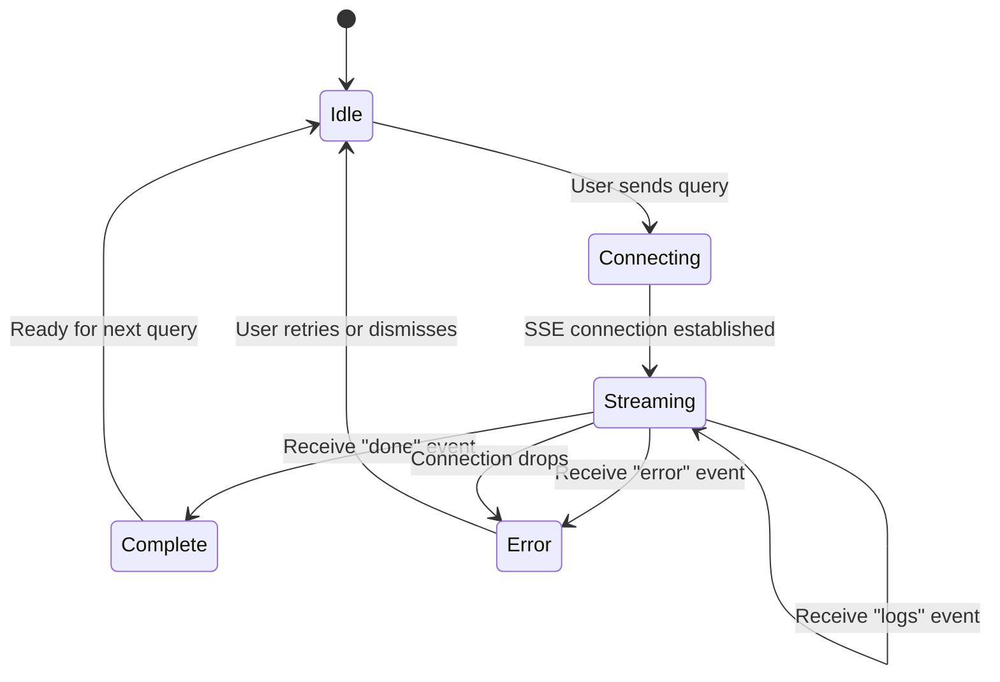

# Frontend Specification

## Design Language
- **Theme**: Dark industrial, glassmorphism panels, neon cyan (#00F0FF) accents.
- **Colors**:
  - Background: #0B0F19
  - Panel background: rgba(255,255,255,0.05) with backdrop blur
  - Primary accent: #00F0FF
  - Secondary accent: #FF007F (comparison highlight)
  - Text: #E0E0E0 (primary), #A0A0A0 (muted)
  - Success: #00FF88
  - Warning: #FFB800
  - Error: #FF3366
  - Surface border: rgba(255,255,255,0.08)
- **Typography**: Inter (headings/body), JetBrains Mono (code/logs)
- **Effects**: Glassmorphism cards, subtle neon glows on hover, smooth transitions (0.3s ease), skeleton loaders during loading.

## CSS Variables

```css
:root {
  /* Colors */
  --bg-primary: #0B0F19;
  --bg-secondary: #111827;
  --bg-panel: rgba(255, 255, 255, 0.05);
  --bg-panel-hover: rgba(255, 255, 255, 0.08);
  --border-subtle: rgba(255, 255, 255, 0.08);
  --border-active: rgba(0, 240, 255, 0.3);

  --accent-primary: #00F0FF;
  --accent-secondary: #FF007F;
  --accent-success: #00FF88;
  --accent-warning: #FFB800;
  --accent-error: #FF3366;

  --text-primary: #E0E0E0;
  --text-muted: #A0A0A0;
  --text-dim: #606880;

  /* Glassmorphism */
  --glass-blur: 12px;
  --glass-bg: rgba(255, 255, 255, 0.05);
  --glass-border: 1px solid rgba(255, 255, 255, 0.08);
  --glass-shadow: 0 8px 32px rgba(0, 0, 0, 0.3);

  /* Spacing */
  --spacing-xs: 4px;
  --spacing-sm: 8px;
  --spacing-md: 16px;
  --spacing-lg: 24px;
  --spacing-xl: 32px;

  /* Radius */
  --radius-sm: 6px;
  --radius-md: 10px;
  --radius-lg: 16px;
  --radius-full: 9999px;

  /* Transitions */
  --transition-fast: 0.15s ease;
  --transition-normal: 0.3s ease;
  --transition-slow: 0.5s ease;

  /* Typography */
  --font-body: 'Inter', system-ui, sans-serif;
  --font-mono: 'JetBrains Mono', monospace;

  /* Layout */
  --sidebar-width: 320px;
  --sidebar-collapsed-width: 0px;
  --right-panel-width: 400px;
  --right-panel-expanded-width: 600px;
  --input-bar-height: 72px;
  --header-height: 56px;
}
```

## Layout

- **Left Sidebar** (width: 320px): Collapsible via hamburger icon. Contains:
  - Feature Toggles for all 7 techniques.
  - Retrieval Mode Selector dropdown.
  - Live Metrics Panel.
- **Main Chat Area** (flex-grow):
  - Scrollable conversation.
  - Input bar at bottom.
- **Right Panel** (width: 400px, expandable via button): Three tabs: Log Stream, Chunk Inspector, Comparison View.

```
┌──────────────────────────────────────────────────────────────────────┐
│  Header: Logo + Title + Hamburger (left) + Right Panel Toggle       │
├──────────┬──────────────────────────────────────┬────────────────────┤
│          │                                      │                    │
│  Left    │         Main Chat Area               │    Right Panel     │
│ Sidebar  │                                      │                    │
│  320px   │       (flex-grow: 1)                  │     400px          │
│          │                                      │                    │
│ ┌──────┐ │  ┌────────────────────────────────┐  │  ┌──────────────┐ │
│ │Toggle│ │  │  Message bubbles (scrollable)  │  │  │ Tab Bar:     │ │
│ │Panel │ │  │                                │  │  │ Logs|Chunks| │ │
│ │      │ │  │  User message (right-aligned)  │  │  │ Compare      │ │
│ │hybrid│ │  │  Bot message (left-aligned)    │  │  ├──────────────┤ │
│ │remote│ │  │    └─ sources expandable       │  │  │              │ │
│ │query │ │  │                                │  │  │  Tab content │ │
│ │meta  │ │  │                                │  │  │  (scrollable)│ │
│ │multi │ │  └────────────────────────────────┘  │  │              │ │
│ │hnsw  │ │  ┌────────────────────────────────┐  │  │              │ │
│ │stream│ │  │  Input bar: text + send button │  │  │              │ │
│ └──────┘ │  └────────────────────────────────┘  │  └──────────────┘ │
│ ┌──────┐ │                                      │                    │
│ │Mode  │ │                                      │                    │
│ │Select│ │                                      │                    │
│ └──────┘ │                                      │                    │
│ ┌──────┐ │                                      │                    │
│ │Metric│ │                                      │                    │
│ │Panel │ │                                      │                    │
│ └──────┘ │                                      │                    │
└──────────┴──────────────────────────────────────┴────────────────────┘
```

## Component Tree

```
App.vue
├── AppHeader.vue
│   ├── HamburgerButton (toggles left sidebar)
│   ├── AppLogo + Title
│   └── RightPanelToggle (toggles right panel)
│
├── LeftSidebar.vue (v-show="sidebarOpen")
│   ├── FeatureToggles.vue
│   │   └── ToggleSwitch.vue × 7 (one per feature)
│   │       Props: { label: string, featureKey: string, enabled: boolean }
│   │       Emits: toggle(featureKey, value)
│   ├── RetrievalModeSelector.vue
│   │   └── <select> dropdown: ["Dense Only", "Hybrid", "Multi-Index"]
│   └── MetricsPanel.vue
│       ├── MetricCard.vue (retrieval_time_ms)
│       ├── MetricCard.vue (generation_time_ms)
│       ├── MetricCard.vue (recall@5)
│       └── MetricCard.vue (MRR)
│
├── ChatArea.vue (flex-grow)
│   ├── MessageList.vue (overflow-y: auto, scroll-to-bottom)
│   │   └── MessageBubble.vue × N
│   │       Props: { role: 'user'|'assistant', content: string, sources?: Chunk[], isStreaming: boolean }
│   │       ├── UserMessage (right-aligned, accent border)
│   │       └── AssistantMessage (left-aligned, glass card)
│   │           └── SourcesAccordion.vue (expandable list of cited chunks)
│   │               └── SourceChip.vue × M
│   │                   Props: { title: string, score: float, chunk_index: int }
│   ├── SkeletonLoader.vue (shown during retrieval phase)
│   └── ChatInput.vue (sticky bottom)
│       ├── <textarea> (auto-resize, Shift+Enter for newline, Enter to send)
│       ├── BaselineToggle (checkbox: "Compare with baseline")
│       └── SendButton (disabled while streaming)
│
└── RightPanel.vue (v-show="rightPanelOpen")
    ├── TabBar.vue
    │   └── TabButton.vue × 3 ["Log Stream", "Chunk Inspector", "Comparison"]
    ├── LogStreamTab.vue (active when tab=0)
    │   └── LogEntry.vue × N (auto-scroll, newest at bottom)
    │       Props: { timestamp: string, stage: string, message: string, level: 'info'|'warn'|'debug' }
    │       Renders: monospace, color-coded by level
    ├── ChunkInspectorTab.vue (active when tab=1)
    │   └── ChunkCard.vue × K
    │       Props: { rank: int, text: string, metadata: object, dense_score: float, bm25_score?: float, fused_score?: float }
    │       Renders: chunk text (truncated + expandable), metadata tags, score bars
    └── ComparisonTab.vue (active when tab=2)
        ├── BaselineColumn.vue (left half)
        │   └── ChunkCard.vue × K (baseline results)
        └── EnhancedColumn.vue (right half)
            └── ChunkCard.vue × K (enhanced results, with highlight on rank changes)
```

## State Management (Composables)

The application uses Vue 3 composables (`/composables/`) with `reactive` and `ref` for state. No Vuex/Pinia needed due to contained scope.

### `useChat.js`
```javascript
// State
const messages = ref([])          // Array<{ id, role, content, sources, timestamp }>
const isStreaming = ref(false)
const compareWithBaseline = ref(false)

// Actions
function sendQuery(query, features)   // POST /query, open SSE, append tokens
function clearConversation()
```

### `useFeatures.js`
```javascript
// State
const features = reactive({
  hybrid: false,
  remote_embed: false,
  query_understanding: false,
  metadata_aware: false,
  multi_index: false,
  hnsw: false,
  stream_sources: false
})

// Actions
function toggleFeature(key)           // Flip boolean
function resetAllFeatures()           // Set all to false
function getFeaturePayload()          // Returns plain object snapshot
```

### `useMetrics.js`
```javascript
// State
const currentMetrics = reactive({
  retrieval_time_ms: null,
  generation_time_ms: null,
  recall_at_5: null,
  mrr: null
})
const baselineMetrics = reactive({ /* same shape */ })

// Actions
function updateMetrics(metricsPayload)
function updateBaseline(metricsPayload)
function getDelta(key)                // Returns current - baseline
```

### `useLogs.js`
```javascript
// State
const logEntries = ref([])            // Array<{ timestamp, stage, message, level }>
const maxEntries = 200

// Actions
function appendLogs(entries)          // Push + trim to maxEntries
function clearLogs()
```

### `useChunks.js`
```javascript
// State
const enhancedChunks = ref([])        // Array<ChunkResult>
const baselineChunks = ref([])        // Array<ChunkResult> (when compare mode on)

// ChunkResult shape:
// { id, text, metadata: { source, error_code, product, chunk_index, article_id },
//   dense_score, bm25_score?, fused_score?, rank }

// Actions
function setChunks(chunks, isBaseline)
function clearChunks()
```

## SSE Connection Lifecycle



**SSE handling in `useChat.js`:**
1. `POST /query` with `Accept: text/event-stream`.
2. Parse each SSE line: `event: <type>\ndata: <json>\n\n`.
3. On `sources`: populate chunk inspector and optionally comparison view.
4. On `token`: append text to current assistant message (`isStreaming = true`).
5. On `metrics`: update `useMetrics` state. Sidebar metrics panel re-renders.
6. On `logs`: append to `useLogs`. Log stream tab auto-scrolls.
7. On `done`: set `isStreaming = false`, finalize message.
8. On `error`: show toast notification, set `isStreaming = false`.

## Responsive Behavior

| Breakpoint | Left Sidebar | Right Panel | Chat Area |
|-----------|-------------|------------|-----------|
| ≥ 1400px | Visible (320px) | Visible (400px) | Fills remaining |
| 1024–1399px | Collapsed (overlay) | Collapsed (overlay) | Full width |
| < 1024px | Collapsed (overlay) | Collapsed (overlay) | Full width, input bar simplified |

## Animations & Micro-interactions

| Element | Trigger | Animation |
|---------|---------|-----------|
| Toggle switches | Click | Slide + glow pulse (0.3s) |
| Message bubbles | Appear | Fade-in + slide-up (0.25s) |
| Streaming tokens | Append | Cursor blink at end of text |
| Metric cards | Value change | Number counter animation (0.5s) |
| Log entries | Append | Slide-in from right (0.15s) |
| Chunk cards | Hover | Subtle lift + border glow |
| Tab transitions | Tab click | Crossfade (0.2s) |
| Sidebar collapse | Hamburger click | Slide left (0.3s ease) |
| Right panel expand | Toggle click | Slide right (0.3s ease) |
| Send button | Hover | Neon glow intensify |
| Skeleton loader | Loading state | Shimmer gradient animation |

## Accessibility

- All toggle switches use `role="switch"` with `aria-checked`.
- Tab bar uses `role="tablist"` / `role="tab"` / `role="tabpanel"`.
- Color contrast ratios meet WCAG AA (text on dark backgrounds).
- Keyboard navigation: Tab through toggles, Enter to send, Escape to close panels.
- `aria-live="polite"` on streaming message area for screen readers.