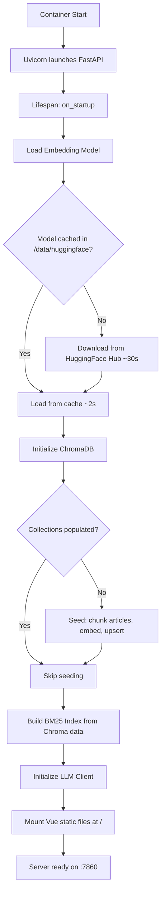

# Deployment (Hugging Face Spaces + Docker)

## Dockerfile

```dockerfile
# ---- Stage 1: Build Vue 3 Frontend ----
FROM node:20-slim AS frontend-build

WORKDIR /app/frontend

# Install dependencies
COPY frontend/package.json frontend/package-lock.json ./
RUN npm ci --no-audit

# Build production bundle
COPY frontend/ ./
RUN npm run build
# Output: /app/frontend/dist/

# ---- Stage 2: Python Backend + Serve ----
FROM python:3.10-slim

# System dependencies
RUN apt-get update && \
    apt-get install -y --no-install-recommends \
        build-essential \
        curl \
    && rm -rf /var/lib/apt/lists/*

WORKDIR /app

# Python dependencies
COPY requirements.txt ./
RUN pip install --no-cache-dir -r requirements.txt

# Copy backend source
COPY backend/ ./backend/

# Copy data files
COPY data/articles.json ./data/articles.json

# Copy built frontend from stage 1
COPY --from=frontend-build /app/frontend/dist/ ./static/

# Environment variables
ENV HF_HOME=/data/huggingface
ENV CHROMA_PERSIST_PATH=/data/chroma_db
ENV PYTHONUNBUFFERED=1
ENV PORT=7860

# Create persistent data directory
RUN mkdir -p /data/huggingface /data/chroma_db

# Expose port (required by HF Spaces)
EXPOSE 7860

# Health check
HEALTHCHECK --interval=30s --timeout=10s --start-period=120s --retries=3 \
    CMD curl -f http://localhost:7860/health || exit 1

# Start server
CMD ["uvicorn", "backend.main:app", "--host", "0.0.0.0", "--port", "7860"]
```

## requirements.txt

```
fastapi==0.111.0
uvicorn[standard]==0.30.1
chromadb==0.5.3
sentence-transformers==2.7.0
rank-bm25==0.2.2
openai==1.35.0
pydantic==2.7.0
slowapi==0.1.9
numpy<2.0
```

## Startup Sequence



**Estimated cold start time:**
| Phase | First Run | Subsequent |
|-------|-----------|-----------|
| Model download | ~30s | 0s (cached) |
| Model load | ~3s | ~3s |
| Chroma seeding | ~45s | 0s (persisted) |
| BM25 build | ~2s | ~2s |
| Total | ~80s | ~5s |

## Hugging Face Spaces Configuration

### `README.md` (Space metadata)
```yaml
---
title: Industrial RAG Demonstrator
emoji: 🔧
colorFrom: cyan
colorTo: indigo
sdk: docker
app_port: 7860
pinned: false
---
```

### Secrets Configuration

Set the following secret in the HF Space settings:

| Secret Name | Value | Required |
|------------|-------|----------|
| `CEREBRAS_API_KEY` | Your Cerebras API key | Yes |

**Note:** The `CEREBRAS_API_KEY` is injected as an environment variable by HF Spaces. The application will fail to start if this secret is not configured.

## Persistent Storage

Hugging Face Spaces provides a `/data` persistent volume:
- `/data/huggingface/` — Cached embedding model files (~90MB)
- `/data/chroma_db/` — ChromaDB persistent storage (~50MB)

Data survives container restarts and redeploys. Only deleted when the Space is deleted.

## Resource Limits

| Resource | Limit | Usage |
|----------|-------|-------|
| RAM | 16 GB | ~2GB model + ~500MB Chroma + ~200MB BM25 |
| CPU | 2 vCPU | Embedding + BM25 search |
| Disk | 50 GB | Persistent volume at /data |
| GPU | None | CPU-only inference |

## Static File Serving

FastAPI serves the built Vue SPA:
```python
from fastapi.staticfiles import StaticFiles

# Mount after API routes to avoid path conflicts
app.mount("/", StaticFiles(directory="static", html=True), name="static")
```

The `html=True` parameter enables SPA-style routing — all unmatched paths serve `index.html`.

## Local Development

```bash
# Terminal 1: Backend
cd backend
export CEREBRAS_API_KEY="your-key-here"
uvicorn main:app --host 127.0.0.1 --port 7860 --reload

# Terminal 2: Frontend (with hot reload)
cd frontend
npm run dev
# Vite dev server at http://localhost:5173, proxying /query and /embed to :7860
```

**Vite Proxy Config (vite.config.js):**
```javascript
export default defineConfig({
  server: {
    proxy: {
      '/query': 'http://127.0.0.1:7860',
      '/embed': 'http://127.0.0.1:7860',
      '/health': 'http://127.0.0.1:7860',
    }
  }
})
```