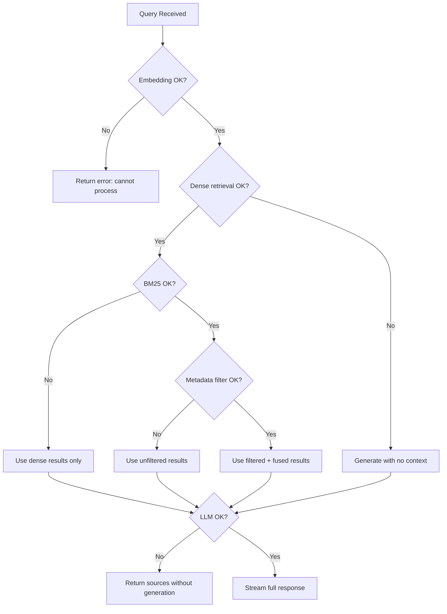

# Error Handling & Edge Cases

## Error Taxonomy

Every error in the system falls into one of these categories. Each has a defined recovery strategy and user-facing message.

### Backend Errors

| Code | Category | Trigger | Recovery | User Message (SSE) | Log Level |
|------|----------|---------|----------|-------------------|-----------|
| `ERR_STARTUP_MODEL` | Fatal | Embedding model fails to load | Crash — container restarts | N/A (app never starts) | CRITICAL |
| `ERR_STARTUP_CHROMA` | Fatal | Chroma DB init fails | Crash — container restarts | N/A | CRITICAL |
| `ERR_STARTUP_API_KEY` | Fatal | `CEREBRAS_API_KEY` missing | Crash with clear message | N/A | CRITICAL |
| `ERR_LLM_RATE_LIMIT` | Recoverable | Cerebras 429 response | Send error event, suggest retry | "LLM rate limit reached. Please try again in 60 seconds." | WARN |
| `ERR_LLM_TIMEOUT` | Recoverable | Cerebras request >30s | Send error event | "LLM response timed out. Please try again." | WARN |
| `ERR_LLM_INVALID` | Recoverable | Malformed LLM response | Send error event | "Failed to generate response. Please try again." | ERROR |
| `ERR_LLM_STREAM_DROP` | Recoverable | SSE stream interrupted mid-generation | Finalize partial message, send done | "Response was truncated due to a connection issue." | WARN |
| `ERR_EMBED_FAIL` | Recoverable | Embedding encode fails | Send error event | "Failed to process your query. Please try again." | ERROR |
| `ERR_CHROMA_QUERY` | Recoverable | Chroma query fails | Fall back to empty results | "Retrieval failed. Generating response without context." | ERROR |
| `ERR_BM25_FAIL` | Degraded | BM25 search fails | Skip BM25, use dense only | (logged, no user error — degrades gracefully) | WARN |
| `ERR_METADATA_PARSE` | Degraded | Metadata extraction fails | Skip filtering, use unfiltered | (logged, no user error) | WARN |
| `ERR_VALIDATION` | Client | Invalid request body | 400 response | `{"detail": "...field-level error..."}` | INFO |
| `ERR_RATE_LIMIT` | Client | Too many requests | 429 response | `{"detail": "Rate limit exceeded. Max 10 queries per minute."}` | INFO |

### Frontend Errors

| Category | Trigger | Recovery | User Feedback |
|----------|---------|----------|---------------|
| SSE connection fails | Network error or server down | Show error toast, enable retry button | "Connection lost. Click to retry." |
| SSE timeout | No events for 60s | Close connection, show timeout | "Request timed out. Please try again." |
| SSE parse error | Malformed event data | Skip event, log to console | (silent — individual event skipped) |
| Empty response | No tokens received | Show "no results" message | "No answer could be generated for this query." |
| Missing sources | Sources event empty | Hide chunk inspector, show message | "No relevant documents found." |

---

## Graceful Degradation Strategy

The system degrades gracefully when non-critical components fail. The user always gets a response, even if reduced quality.



**Priority order** (must work → nice to have):
1. ✅ Embedding encode — **required** (no fallback)
2. ✅ Dense retrieval — **required** (without this, no context)
3. ⚠️ BM25 — **optional** (degrades to dense-only)
4. ⚠️ Metadata filtering — **optional** (degrades to unfiltered)
5. ⚠️ LLM generation — **optional** (can return just sources)

---

## SSE Error Event Protocol

When a recoverable error occurs during streaming:

```python
async def handle_query_error(error: Exception, stage: str):
    """
    Send an SSE error event and close the stream.

    Rules:
    1. NEVER expose internal error details, stack traces, or file paths.
    2. Always include the failed stage for debugging.
    3. Log full error details server-side.
    4. Send 'done' event after 'error' to cleanly close the stream.
    """
    # Log full error server-side
    logger.error(f"Query failed at {stage}: {error}", exc_info=True)

    # Map internal errors to safe user messages
    user_message = ERROR_MESSAGES.get(type(error).__name__, "An unexpected error occurred. Please try again.")

    yield sse_event("error", {"message": user_message, "stage": stage})
    yield sse_event("done", {})
```

**Error message map:**
```python
ERROR_MESSAGES = {
    "RateLimitError": "LLM rate limit reached. Please try again in 60 seconds.",
    "TimeoutError": "Request timed out. Please try again.",
    "ConnectionError": "Failed to connect to LLM service. Please try again.",
    "ValidationError": "Invalid query format.",
    "ChromaError": "Retrieval service temporarily unavailable.",
}
```

---

## Edge Cases

### Query Edge Cases

| Input | Expected Behavior | Spec Ref |
|-------|------------------|----------|
| Empty string `""` | 400 validation error | 04 |
| Whitespace only `"   "` | 400 validation error (after strip) | 04 |
| Single character `"?"` | Valid — classified as FACT, top_k=3 | 05 |
| 2000 character query | Valid — processed normally | 04 |
| 2001 character query | 400 validation error | 04 |
| Unicode: `"如何修复 E452?"` | Valid — processed, BM25 may not match well | 05 |
| SQL injection: `"'; DROP TABLE--"` | Valid as text, no SQL in system | 04 |
| HTML/script: `"<script>alert(1)</script>"` | Valid as text, frontend uses `textContent` not `innerHTML` | 03 |
| Query with no relevant docs | Empty sources, LLM generates "I don't have enough information" | 06 |
| Rapid consecutive queries | Rate limited after 10/min | 04 |

### Retrieval Edge Cases

| Scenario | Expected Behavior | Spec Ref |
|----------|------------------|----------|
| Chroma returns 0 results | Empty chunks, LLM told "no context available" | 05 |
| BM25 returns 0 results | Use dense results only (no fusion) | 05 |
| All BM25 scores are 0 | Treat as no BM25 results | 05 |
| Metadata filter matches 0 docs | Fall back to unfiltered query | 05 |
| COMPARE query with no clear split | Treat as single query | 05 |
| Duplicate chunks across dense+BM25 | Deduplicated by ID during RRF | 05 |

### Frontend Edge Cases

| Scenario | Expected Behavior | Spec Ref |
|----------|------------------|----------|
| User sends while streaming | Send button disabled during stream | 03 |
| User closes tab during stream | SSE connection closed, server cleans up | 04 |
| Very long LLM response (>2000 tokens) | Scrollable message area, no truncation | 03 |
| Server returns 500 | Error toast displayed, input re-enabled | 03 |
| Slow network (>5s first byte) | Skeleton loader shown during wait | 03 |
| All toggles enabled at once | Valid — all features applied in pipeline order | 05 |
| Toggle changed during streaming | No effect on current stream, applied to next query | 03 |

---

## Startup Failure Handling

```python
from contextlib import asynccontextmanager

@asynccontextmanager
async def lifespan(app: FastAPI):
    """Application lifespan with startup error handling."""
    try:
        # Step 1: Validate configuration
        if not settings.cerebras_api_key:
            raise RuntimeError(
                "CEREBRAS_API_KEY environment variable is required. "
                "Set it in .env for local dev or as a Space Secret for HF Spaces."
            )

        # Step 2: Load embedding model
        logger.info("Loading embedding model...")
        embedding_service.load()
        logger.info("Embedding model loaded successfully")

        # Step 3: Initialize Chroma
        logger.info("Initializing ChromaDB...")
        chroma_store.initialize(embedding_service)
        logger.info(f"ChromaDB ready: {chroma_store.get_stats()}")

        # Step 4: Build BM25 index
        logger.info("Building BM25 index...")
        bm25_index = build_bm25_index(chroma_store)
        logger.info(f"BM25 index ready: {len(bm25_index.doc_ids)} documents")

        # Step 5: Initialize LLM client
        llm_client = LLMClient()
        logger.info("LLM client initialized")

        yield

    except Exception as e:
        logger.critical(f"Startup failed: {e}", exc_info=True)
        raise  # Let uvicorn handle the crash
```

## Request Timeout Handling

```python
import asyncio

QUERY_TIMEOUT_SECONDS = 60  # Total timeout for query processing
LLM_TIMEOUT_SECONDS = 30    # Timeout for LLM streaming

async def process_query_with_timeout(query_request):
    """Wrap the full query pipeline in a timeout."""
    try:
        async for event in asyncio.wait_for(
            process_query(query_request),
            timeout=QUERY_TIMEOUT_SECONDS,
        ):
            yield event
    except asyncio.TimeoutError:
        yield sse_event("error", {
            "message": "Request timed out after 60 seconds. Please try a simpler query.",
            "stage": "timeout",
        })
        yield sse_event("done", {})
```
